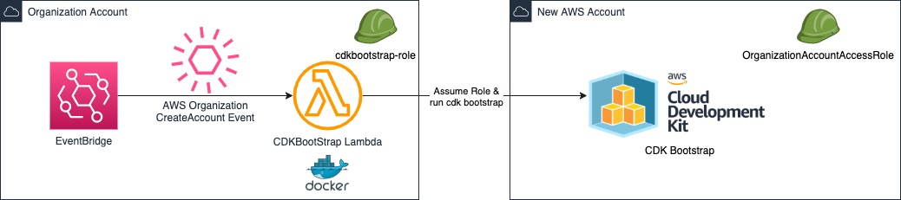

# CDK Bootstrap a new account once created using EventBridge with AWS Organizations
A CDK App to automate the CDK bootstrap process in a new account once created, what an irony :stuck_out_tongue:

## CDK App
* The CDK application will create
    * An IAM Role which will be used to run the Lambda
	* This role is used to execute the lambda, while also having the permissions to assume the `OrganizationAccountAccessRole` or `AWSControlTowerExecution` role in the destination account.
	* EventBridge event part of the `default` bus, which will monitor for `CreateAccountResult` event.
	* Docker Lambda container which has `npm` packaged.

## Workflow
* Eventbridge Rule to monitor `CreateAccountResult` cloudtrail event
* Event will invoke Lambda, which will check if the account is created successfully and uses the IAM role created to assume the `OrganizationAccountAccessRole` or `AWSControlTowerExecution` role in the new account.
* The lambda is a Docker container image which has `npm` packaged, so that it could be run part of the bootstrapping process.

## Notes
* There are multiple ways to achieve what we are doing here, such as 
    * Use the CloudFormation template which is used to bootstrap directly as a CF template the destination account, instead of doing the `npm` and subprocess fu
* This process is intended to be augmented with the original python script which was run from a local machine, which is capable of bootstrapping 100s of accounts.
    * Because this is a lambda function run in the Organization/Billing account, this is ideal of bootstrapping new accounts in an automated fashion.
